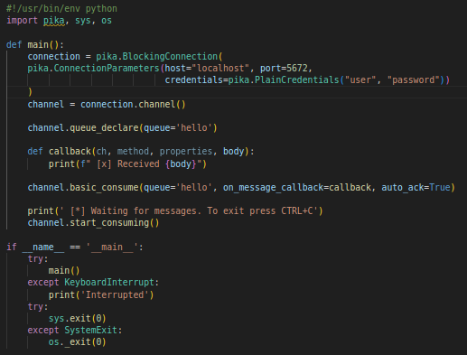

Acontinuacion vamos a crear un entorno virtual para poder instalar pika.

Posteriormente generamos nuestra aplicacion que va a enviar el mensaje.

Creamos la aplicacion que va a recibir nuestro mensaje por el mismo canal que enviamos el mensaje anterior.

Cramos nuestro docker-compose que va a levantar nuestro servicio de rabbitMQ y lo ejecutamos.

Posteriormente jecutamos primeramente nuestro send.py y luego receive,py y obtenermos nuestro resutado en consola

